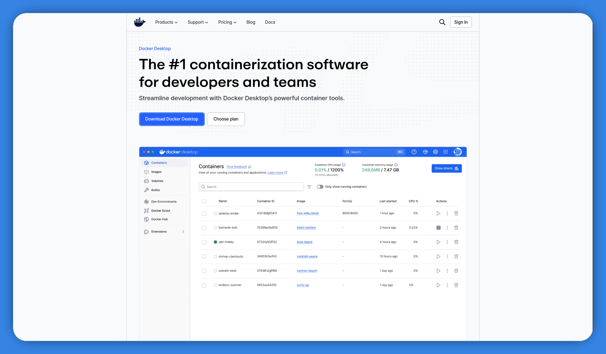
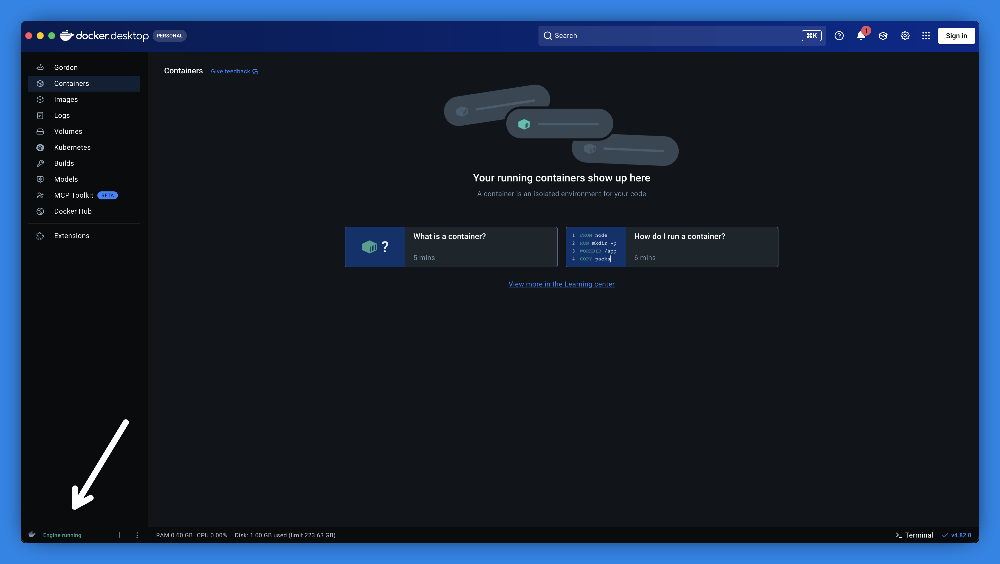
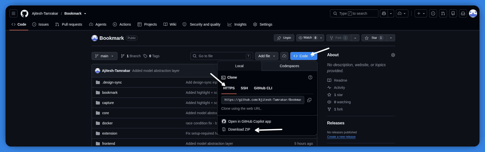
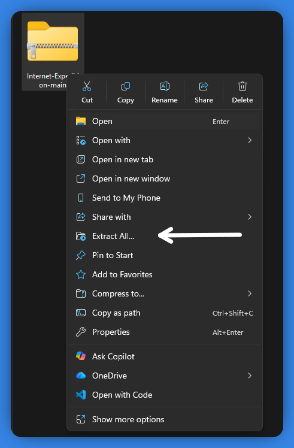
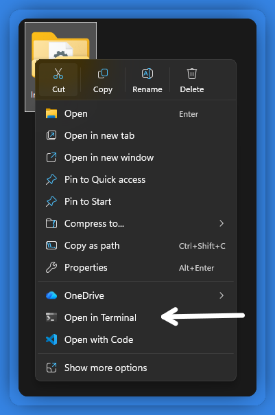
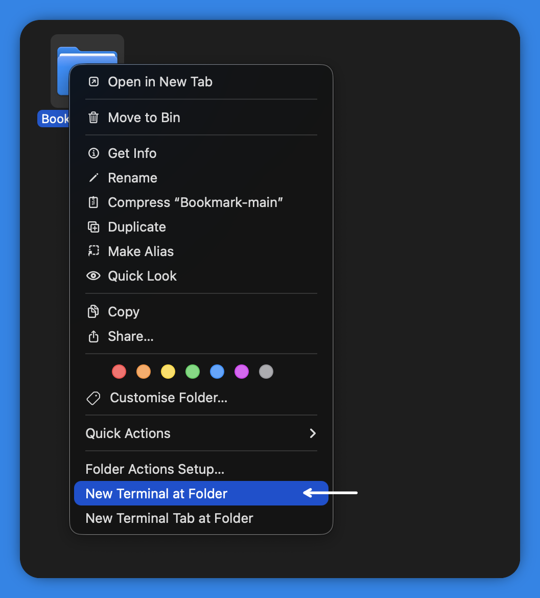
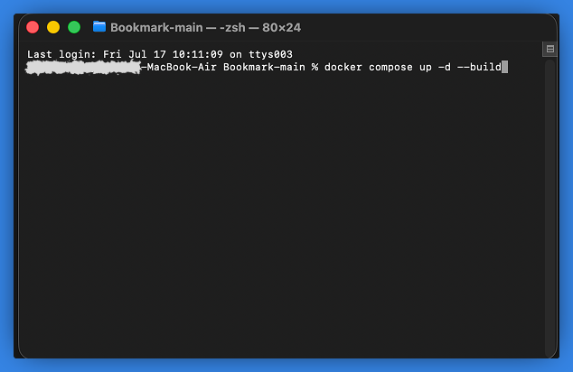
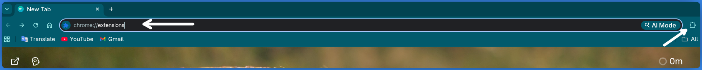
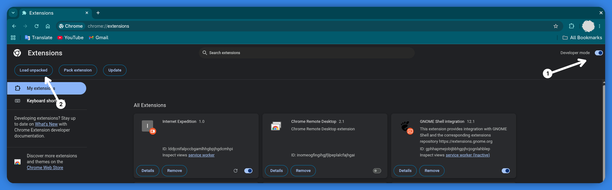
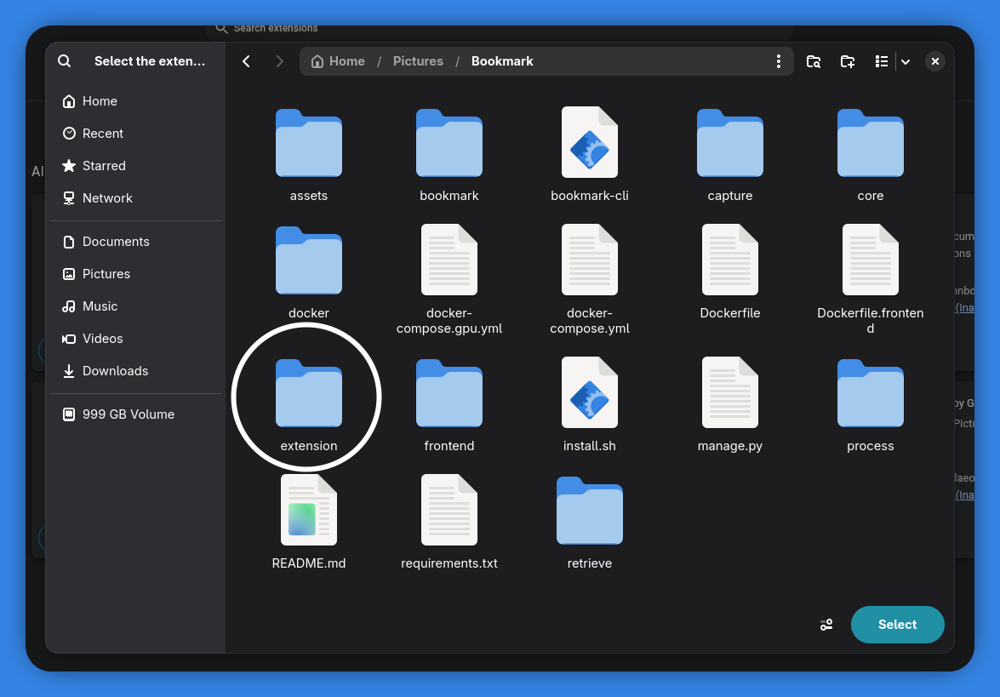

# Internet Expedition 🔖

Save anything you find online (videos, posts, articles, pins) and find it
again later just by describing what you remember about it.

No account. No subscription. Nothing you save ever leaves your computer.

---

## Which computer are you using?

- [Windows](#windows-setup)
- [Mac](#mac-setup)
- [Linux](#linux-setup)

Then continue to [Load the browser extension](#load-the-browser-extension). That part is the same for everyone.

---

## Windows Setup

### Step 1: Install Docker Desktop

Docker Desktop is a free program that lets Internet Expedition run safely on your computer.

1. Go to [docker.com/products/docker-desktop](https://www.docker.com/products/docker-desktop/)
2. Download **Docker Desktop for Windows**
3. Open the downloaded file and follow the on-screen installer
4. Once installed, open Docker Desktop from your Start menu and leave it running



> 💡 If Windows shows a blue "Windows protected your PC" warning while installing, click **More info**, then **Run anyway**. This just means the installer isn't digitally signed yet, not that something is wrong.

**Make sure it's actually running before moving on:**

Open the Docker Desktop app and look at the bottom-left corner. It should say
**"Engine running"** next to a green icon. If it says "Starting..." or looks
different, wait a minute and check again.



> 💡 If Docker Desktop asks you to enable **WSL2** during install, click yes.
> This is normal and required.

### Step 2: Download Internet Expedition

1. Go to the project page: [https://github.com/Ajitesh-Tamrakar/Bookmark](https://github.com/Ajitesh-Tamrakar/Bookmark)
2. Click the **Code** button
3. In the dropdown that opens, click **Download ZIP** near the bottom



4. Open your Downloads folder — you'll find the ZIP file there

### Step 3: Extract the ZIP

1. Right-click the ZIP file
2. Choose **Extract All...**
3. Extract it somewhere easy to find, like your Desktop



### Step 4: Open a terminal in that folder

1. Open the folder you just extracted (you should see files like `docker-compose.yml` inside it)
2. Right-click inside the folder (on empty space) and choose **Open in Terminal**



A terminal window opens, already pointed at the right folder.

> 💡 Don't see an **Open in Terminal** option? Click once in the empty address
> bar at the top of the File Explorer window, type `cmd`, and press **Enter**
> instead — that opens a Command Prompt in the same folder.

### Step 5: Start it up

In the terminal window, type this exactly and press **Enter**:

```
docker compose up -d --build
```

The first time you do this, it will take several minutes while it downloads
and builds everything it needs. You'll see a lot of text scroll by. That's
normal.

### Step 6: How do you know it worked?

The terminal will finish and give you back a blinking cursor. That
just means the *instruction* was sent, not that the app is fully ready yet.

The reliable way to check:

1. Switch to the **Docker Desktop** app
2. Click **Containers** in the left sidebar
3. You should see a group of containers, all with a green dot next to them

Once everything is green, open Chrome and go to:

**http://localhost:8081**

> 💡 The very first time, it may take an extra minute or two while it finishes
> downloading the AI model in the background. If the page looks empty, wait
> a bit and refresh.

Continue to [Load the browser extension](#load-the-browser-extension) below.

---

## Mac Setup

### Step 1: Install Docker Desktop

1. Go to [docker.com/products/docker-desktop](https://www.docker.com/products/docker-desktop/)
2. Download **Docker Desktop for Mac** (choose Apple Silicon or Intel; if unsure, click the Apple menu → About This Mac to check your chip)
3. Open the downloaded file and drag Docker into Applications
4. Open Docker Desktop from Applications and leave it running


**Make sure it's actually running before moving on:**

Open Docker Desktop (or click the whale icon in the menu bar to bring it to
the front). In the bottom-left corner it should say **"Engine running"**
next to a green icon. If it says "Starting...", wait a minute and check again.


### Step 2: Download Internet Expedition

1. Go to the project page: [https://github.com/Ajitesh-Tamrakar/Bookmark](https://github.com/Ajitesh-Tamrakar/Bookmark)
2. Click the **Code** button
3. In the dropdown that opens, click **Download ZIP** near the bottom
4. Find the ZIP in your Downloads folder and double-click it to unzip


5. Move the unzipped folder somewhere easy to find, like your Desktop

### Step 3: Open a terminal in that folder

1. Right-click (or Control-click) the unzipped project folder in Finder
2. Choose **New Terminal at Folder**



A Terminal window opens, already pointed at the right folder.

> 💡 Don't see that option? Open **Spotlight** (`Cmd + Space`), type
> **Terminal**, press Enter, then type `cd ` (with a space after it) and
> drag the project folder from Finder into the Terminal window before
> pressing Enter. Terminal will fill in the correct path for you.

### Step 4: Start it up

In the Terminal window, type this exactly and press **Enter**:

```
docker compose up -d --build
```



The first time you do this, it will take several minutes while it downloads
and builds everything. Lots of text scrolling by is normal.

### Step 5: How do you know it worked?

Terminal will return you to a normal prompt when it's done issuing the start
command. That doesn't mean the app is fully ready yet.

The reliable way to check:

1. Switch to the **Docker Desktop** app
2. Click **Containers** in the left sidebar
3. You should see a group of containers, all with a green dot next to them

Once everything is green, open Chrome and go to:

**http://localhost:8081**

> 💡 The very first time, it may take an extra minute or two while it finishes
> downloading the AI model in the background. If the page looks empty, wait
> a bit and refresh.

Continue to [Load the browser extension](#load-the-browser-extension) below.

---

## Linux Setup

1. Open a terminal
2. Clone the repo and run the install script:

```bash
git clone https://github.com/Ajitesh-Tamrakar/Bookmark.git
cd Bookmark
bash install.sh
```

`install.sh` handles everything for you:
- Checks that Docker is installed and running
- Detects an NVIDIA GPU and enables it automatically if present
- Builds and starts all the services
- Waits until the app is actually responding (not just "started")
- Opens `http://localhost:8081` in your default browser automatically
- Installs a `bookmark` command (`bookmark start`, `bookmark stop`, `bookmark status`) for future use, so you don't need to re-run `install.sh` after the first time

Continue to [Load the browser extension](#load-the-browser-extension) below.

---

## Load the browser extension

This part is the same on every operating system.

1. Open Chrome and go to `chrome://extensions` (or click the puzzle-piece icon next to the address bar and choose **Manage extensions**)



2. Turn on **Developer mode** (the switch is in the top-right corner)
3. Click **Load unpacked**



4. In the file picker, browse into your project folder and select the **`extension`** folder itself (not a subfolder, and not the whole project folder)



5. Click the **puzzle-piece icon** in Chrome's toolbar (top-right, next to the address bar)
6. Find **Internet Expedition** in the list and click the **pin** icon next to it, so it stays visible in your toolbar

You're all set. From now on, click the pinned icon any time to open the app.
It'll take you straight to setup the first time, and straight to search after that.

---

## How to Use It

### Saving something

Whenever you find a video, post, pin, or article you want to remember:

1. Right-click anywhere on the page
2. Choose **Save to Internet Expedition** from the menu

No need to type anything or explain why you're saving it. The app
quietly reads and understands the content in the background.

Works on:
- YouTube videos
- Pinterest pins
- LinkedIn posts
- Twitter/X posts
- Any regular website or article

You can also save just a highlighted piece of text: select any text on a
page, right-click, and choose **Save highlight to Internet Expedition**.

### Finding something later

You don't need to remember the title, the website, or even the exact topic.
Just describe it in your own words.

1. Click the pinned Internet Expedition icon in your Chrome toolbar
2. Type a description into the search bar, like:
   - "that video about negotiating a salary"
   - "the recipe with the lemon cake"
   - "post about someone switching careers into design"
3. Press Enter

Click any result to open it again.

### A few tips

- Give it a minute after saving something. It needs a little time to "read" and understand what you saved before it shows up in search.
- The more naturally you describe what you're looking for, the better. You don't need exact keywords.
- Everything stays on your computer. Nothing is uploaded anywhere.
